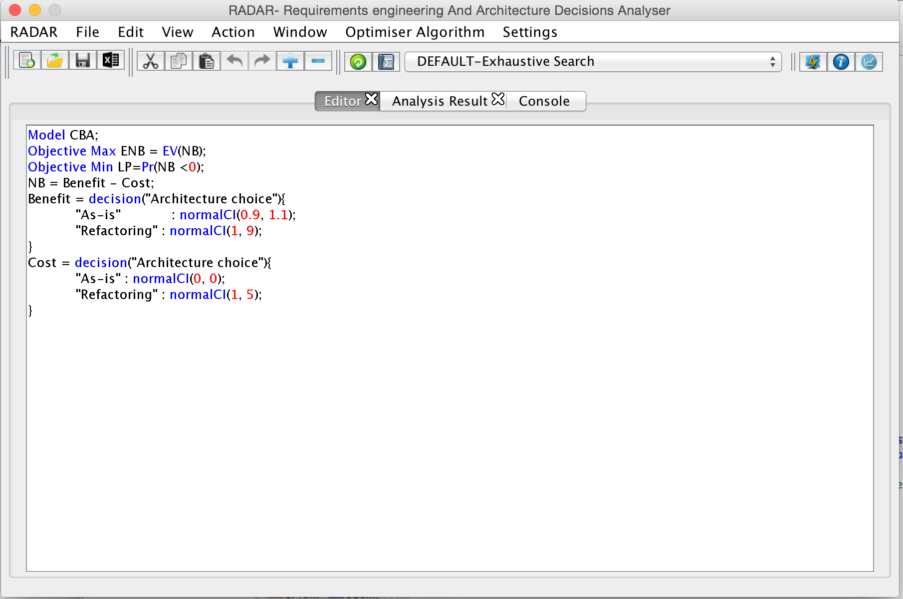
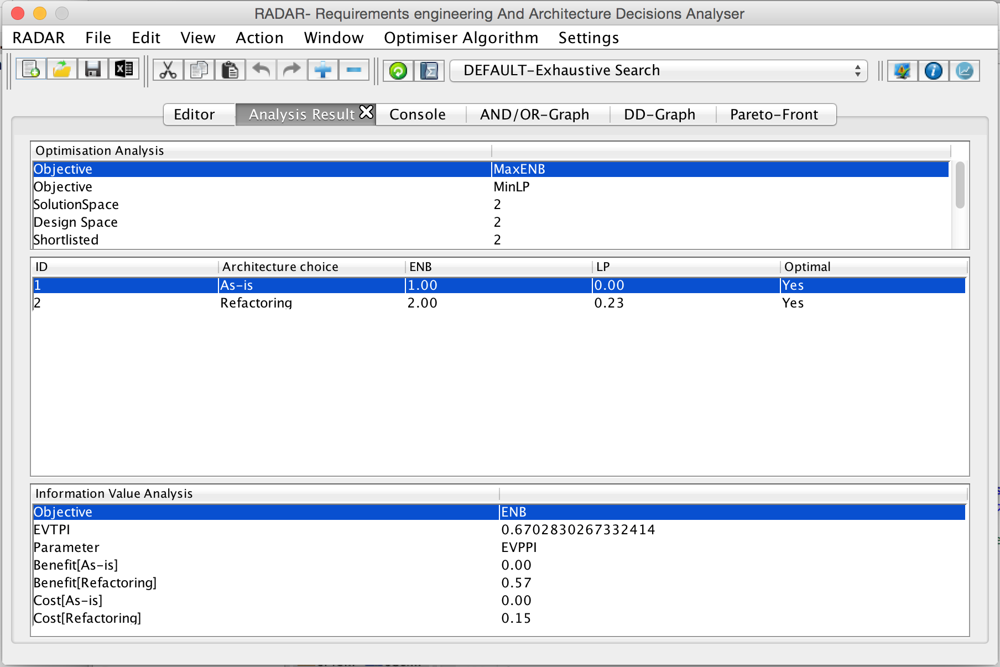

# RADAR - The Requirements and Architecture Decision AnalyseR

RADAR is a lightweight modelling language and automated decision analysis tool to support multi-objective decision under uncertainty in requirements engineering and software architecture.

RADAR analysis provides useful feedback to requirement engineers and software designers about:

*   Which decisions are better than others in the decision model of a particular software intensive system.
*   What objective values can be attained with different designs.
*   What tradeoffs can be made between shortlisted designs (solutions).
*   What parameter uncertainty may deserve additional data collection and analysis before making their decision.
*   What parameter uncertainty does not matter to their decision.

## Papers

The modelling language and decision analysis support tool are described in the following paper which has been accepted for publication at ICSE17:

> [RADAR: A Lightweight Tool for Requirements and Architecture Decision Analysis](radar_icse17.pdf), accepted in ICSE17\.  
> Authors: [Saheed A. Busari](http://www0.cs.ucl.ac.uk/staff/s.busari/) and [Emmanuel Letier](http://letier.cs.ucl.ac.uk/)

The scalability analysis of RADAR desision support tool is described in the paper below:

> [Scalability Analysis of the RADAR Decision Support Tool](https://arxiv.org/pdf/1702.02977.pdf).  
> Authors: [Saheed A. Busari](http://www0.cs.ucl.ac.uk/staff/s.busari/) and [Emmanuel Letier](http://letier.cs.ucl.ac.uk/)

## Download

The RADAR tool is available and can be downloaded [here](RADAR.jar), and all model examples used in the paper can be downloaded [here](ModelExamples.zip).

We have also made the [source code](https://github.com/sbusari/RADAR) of the tool available in GitHub. The tool is implemented in Java and uses <a "http:="" www.antlr.org="" "="">ANTLR</a> to generate model parser, generates diagrams in [DOT format](http://www.graphviz.org/Documentation/dotguide.pdf) , and uses [Graphviz](http://graphviz.org/) (also available in [browser](http://webgraphviz.com/) ) to visualise the diagrams.

## How to Use RADAR

RADAR is a self-contained jar file. Simply download the file to your computer and double click to launch the application (needs [JRE 1.7](http://www.oracle.com/technetwork/java/javase/downloads/index.html) or later versions). Once the application is launched successfully, a window appears with three panels as shown in figure 1:

*   **Model Board** where modellers can write their own models and also load existing models for review.
*   **Analysis Settings** for specifying parameters for model analysis. Examples of these parameters includes:
    1.  The number of Monte-Carlo simulation run.
    2.  Output directory where model analysis results are stored.
    3.  Information value objective to be used for computing the expected value of total and partial perfect information (evtpi and evppi)
    4.  Sub-graph objective for restricting the AND/OR graph to a single specified objective
    5.  Some checkboxes used to indicate users' preferences on whether the tool should generate AND/OR dependency graph, decision dependency graph and the Pareto front.
*   **Decisions** which displays all specified model decisions and their corresponding options once the model has been parsed successfully.

**To analyse an existing model**, the following steps can be followed:

1.  Enable the model board by either clicking **enable model board** under the Radar menu or clicking the **write model** under the Action menu.
2.  Open the RADAR file (we recommend starting with the first example below i.e. refactoring cost-benefit analysis) by simply clicking on the file menu and then click **open** to load the existing model on the model board as shown in figure 1\. if successful, you will see the model displayed in the model board. At this point, users can edit the model and save changes by clicking on **save** under the file menu.
3.  Go to the Action menu and click **parse model** to check that the specified model conforms to RADAR syntaxes defined in the paper. If not, an error message is displayed. If successful, you will be prompted to either continue with analysing the model or you could decide to further review the model and later analyse the model by clicking **analyse model** under the Action menu. Note that before parsing the model, you will be required to specify the output directory, which stores model analysis results.
4.  If you click continue with model analysis, RADAR analyses the model as described in the paper, and the analysis results, such as the optimisation analysis, Pareto front (if checkbox is enabled) and information value analysis (if the information value objective is specified), are displayed in another window as shown in figure 2\.

RADAR also saves the following in the specified output directory:

*   The model analysis results in .csv and .out extensions.
*   The AND/OR variable dependency graph (which helps to communicate and validate traceability links between technical software characteristics) and decisions dependency graph (which helps to visualise the dependencies between decisions and options, and also to view a potentially large design space in terms of a smaller set of decisions and options). These graphs are saved in [DOT format](http://www.graphviz.org/Documentation/dotguide.pdf) and can be viewed using [Graphviz](http://graphviz.org/) (also available in [browser](http://webgraphviz.com/)).
*   The Pareto front plot (in .PNG format) which is the set of optimal solutions that show the trade-off that can be made between the multiple and conflicting objectives.

 

Figure 1

Figure 2

**To analyse your own model**, simply follow the same steps after having edited your model in the tool or using an external text editor.

For any question, email: [{saheed.busari.13, e.letier}@ucl.ac.uk](mailto:{saheed.busari.13, e.letier}@ucl.ac.uk)

## Examples

We have applied the tool to the following examples.

<table>

<thead>

<tr>

<th>Example</th>

<th>Brief Description</th>

<th>Report</th>

<th>Radar File</th>

</tr>

</thead>

<tbody>

<tr>

<td>Refactoring cost-benefit analysis</td>

<td>The small example used in the paper to introduce the language and decision analysis method</td>

<td>[refactoring](refactoring_result.html)</td>

<td>[refactoring.rdr](CBA.rdr)</td>

</tr>

<tr>

<td>Plastic card fraud detection system</td>

<td>The running example used in the paper to illustrate the language and analysis functions. The problem consists in selecting among alternative design for a fraud detection system so as to minimise financial loss due to fraud and minimise the number of fraud alerts to be investigated manually</td>

<td>[fraud-detection](fds_report.html)</td>

<td>[fraud-detection.rdr](FDM.rdr)</td>

</tr>

<tr>

<td>Document sharing security policy</td>

<td>This example analyses security policy decisions for an organisation concerned with leaks of confidential information. The analysis extends previous models developed by Tristan Caulfield and David Pym for a real organistion.</td>

<td>[sharing-policy](bspdm_report.html)</td>

<td>[sharing-policy.rdr](BSPDM.rdr)</td>

</tr>

<tr>

<td>Emergency Response System</td>

<td>This example illustrates the use of RADAR on an architecture decision problem used in previous publications (see the report for details). The design space for this model includes 6912 solutions and takes around 2 minutes to analyse.</td>

<td>[emergency-response](sas_report.html)</td>

<td>[emergency-response.rdr](SAS.rdr)</td>

</tr>

<tr>

<td>Satellite Image Processing</td>

<td>This example was first introduce to illustrate the CBAM architecture decision method (see report for full references). We show here how to analyse this problem in RADAR and compare RADAR's approach to CBAM.</td>

<td>[nasa-ecs](ecs_report.html)</td>

<td>[nasa-ecs.rdr](ECS.rdr)</td>

</tr>

</tbody>

</table>

We have also applied RADAR on different [synthetic models](SyntheticModels.zip) to understand the scalability of the tool. The synthetic models are generated using a model generator that generates random syntactically valid RADAR models with a given number of objectives, decisions, number of options per decisions and minimum number of model variables. To create a synthetic model of a specific size, download the model generator jar file and run the command below:

**java -jar ./Downloads/SytheticModelGenerator.jar ./Downloads/SyntheticModel.properties**

In the command above, [SytheticModelGenerator.jar](SyntheticModelGenerator.jar) is the program that generates the synthetic model and [SyntheticModel.properties](SyntheticModel.properties) stores values for the RADAR model constructs, such as the number of objectives, decisions, number of options per decisions and minimum number of model variables. The file [SytheticModel.rdr](SyntheticModel.rdr) contains a synthetic RADAR model with decision dependency and has 2 objectives, minimum of 10 model variables, 4 decisions with their corresponding options ranging between 2 and 3.

The RADAR files can be opened and analysed in the tool following the steps outlined above.

## Roadmap

Radar is an early prototype that we are constantly improving. Our current development goals include:

*   Applying RADAR to additional examples.
*   Extending the language to support decisions with non-mutually exclusive options.
*   Various improvements to the user interface: syntax highlighting, better error messages, and fully integrated graphic generation.
*   Provide fully documented API for use of Radar by external tools.
*   Facilitating generation of decision analysis report by embedding RADAR model fragments and analysis results within markdown documents.